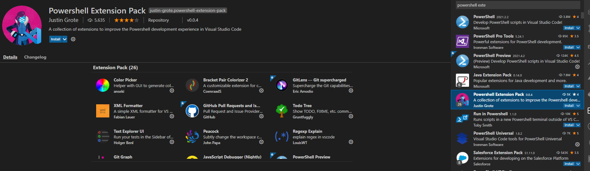

This is an extension pack that includes many useful extensions that assist in Powershell Development.

It also includes useful extensions for working with GitHub and GitHub actions to encourage development there.

# How to Install
In vscode, click the extensions button and search for Powershell Extension Pack. You can choose to install the entire
pack or just individual extensions as you like:

You can also selectively disable extensions installed by the pack as you desire and enable them only for specific workspaces by first disabling them and then choosing Enable (Workspace) by right clicking the specific extension.

# Contributing
Pull request and extension issue suggestions welcome! I will considered however because this is opinionated I am the be-all-end-all as to what goes into the pack. I will always give you my best reason if I don't include something. Thanks!

General Criteria for inclusion:

* Supports Powershell Development both locally and with GitHub
* Improves the editor to make Powershell development easier
* Improves the editor to make documentation of Powershell easier
* Does not impose a significant impact to vscode startup time
